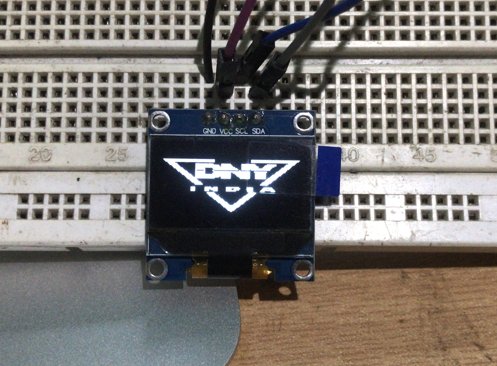
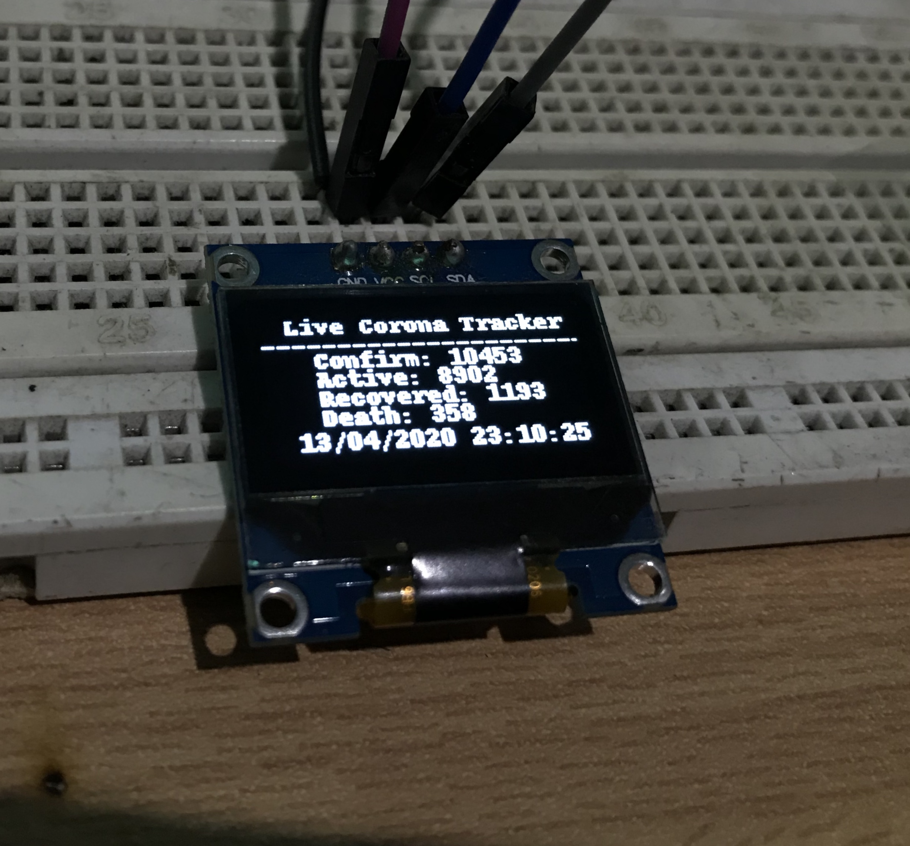

# Raspberrypi_begieners

## Chapter 1:
1. How to control a LED?
2. How to make a led chaser animation?
3. How to take input from a push switch?
4. How to control push switch to control a LED?
 

|Led Blink|2 led Animation|Switch control led|
|:----:|:----:|:----:|
|||  |

## Chapter 2:
1. How to control DC Motors using Raspberry pi and Python?
2. How to control 2 DC motor for a Raspberry pi based car?
3. How to Use Oled With Raspberry pi?
4. How to show custom images on a oled display?
5. how to make a live corona tracker using oled display and Raspberry pi?
 

|Motor Test|Oled Custom Logo|Live Corona Tracker|
|:----:|:----:|:----:|
|||  |

